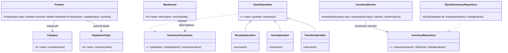

# UML: діаграма класів

```mermaid
classDiagram
 direction TB
 class Product { -ProductInput value -boolean archived +details Readonly~ProductInput~ +update(input) +archive() }
 class Category { +id +name +rename(name) }
 class EquipmentType { +id +name +rename(name) }
 class Warehouse { +id +name +description +archive(total) }
 class StockOperation { <<abstract>> +input +quantity +execute(tx)* }
 class ReceiptOperation { +execute(tx) }
 class IssueOperation { +execute(tx) }
 class TransferOperation { +execute(tx) }
 class InventoryService { -InventoryRepository repo +execute(kind,input) +report() +saveProduct() }
 class InventoryRepository { <<interface>> +transaction(work) +listStock() +listOperations() }
 class SQLiteInventoryRepository { -SQLiteDatabase db +transaction(work) +changeStock() }
 class InventoryTransaction { <<interface>> +getStock() +changeStock() +insertOperation() }
 StockOperation <|-- ReceiptOperation
 StockOperation <|-- IssueOperation
 StockOperation <|-- TransferOperation
 InventoryService --> InventoryRepository : constructor injection
 SQLiteInventoryRepository ..|> InventoryRepository
 StockOperation ..> InventoryTransaction : execute
 Product --> Category : categoryId
 Product --> EquipmentType : optional typeId
 Warehouse "1" --> "*" InventoryTransaction : stock balance
```
