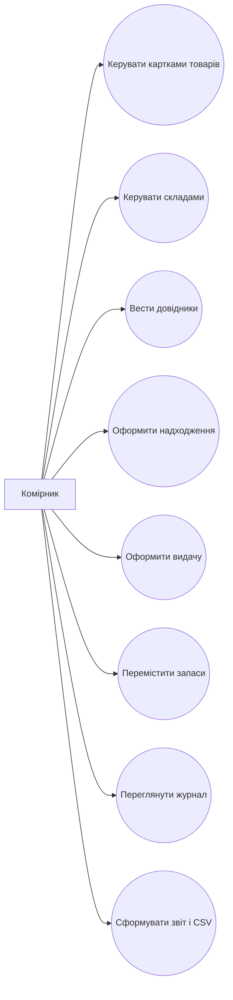

# UML: варіанти використання

```mermaid
flowchart LR
 U["Комірник"]
 P(("Керувати картками товарів"))
 W(("Керувати складами"))
 D(("Вести довідники"))
 R(("Оформити надходження"))
 I(("Оформити видачу"))
 T(("Перемістити запаси"))
 J(("Переглянути журнал"))
 S(("Сформувати звіт і CSV"))
 U --> P
 U --> W
 U --> D
 U --> R
 U --> I
 U --> T
 U --> J
 U --> S
```

Основний актор — працівник складу. Операції руху мають включені перевірки доступного залишку й атомарне оновлення SQLite.
